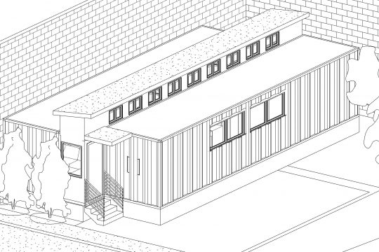

## Introduccion
En ocaciones vamos a necesitar subir el nivel de calidad para nuestros render o recorridos virtuales, en esta ocacion vamos a crear una familia de espejo para pared, con propiedades reflejantes

